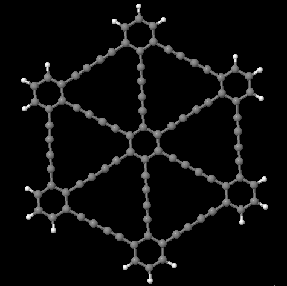
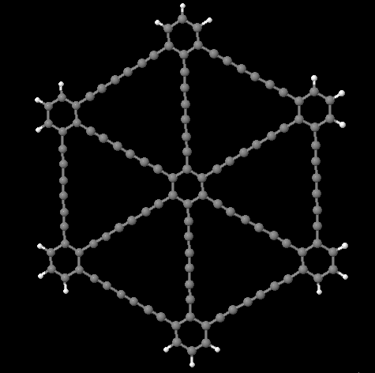
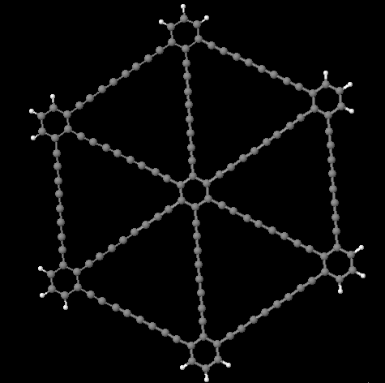
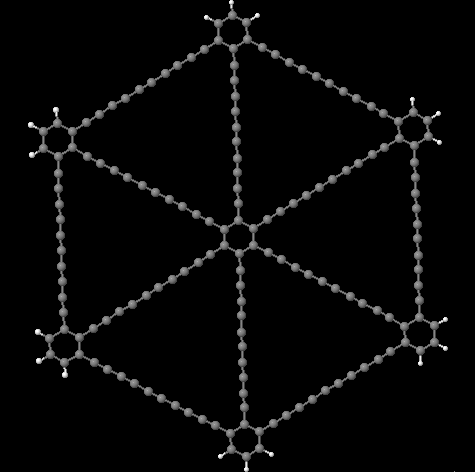
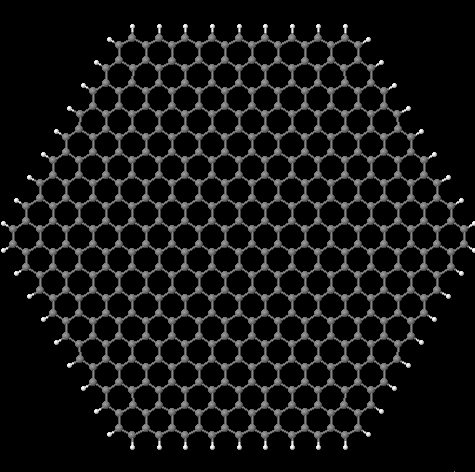

# Dopings: Automação de dopagem, otimização e de análise de estruturas moleculares simuladas pelo DFTB+

Criei esse conjunto de programas, escritos em Python, como parte do meu projeto de pesquisa junto do Laboratório de Simulação Computacional do Departamento de Física da UFJF, com objetivo de pesquisar novos possíveis materiais e suas propriedades teóricas ao simular computacionalmente flocos de grafeno e grafino com impurezas diversas, em variadas posições. As simulações foram feitas utilizando o pacote de simulação quântica DFTB+.

Posteriormente ainda, foi desenvolvido outros programas que geravam versões de tais estruturas adsorvidas com moléculas de H2, para estudar a possibilidade de usar tais estruturas em tecnologia de armazenamento de hidrogênio.

| Elementos | Al,  B, Li, Mg,  N,  Na,  O,  P, Si,  Ti,  Zn |
|-|-|
| Bases grafino | grafino 1, 2, 3, 4, 5 |
|Bases grafeno  | armchair edges, zizag edges |

Foram geradas, otimizadas e processadas, um total de 1.540 estruturas. Além de mais de 300 estruturas adsorvidas com H2.

## Funcionalidades

* Criar versões em lote, de várias estruturas base, dopadas por vários elementos químicos, em diversas posições;
* Criar um diretório de otimização para cada estrutura, com os arquivos e informações necessárias;
* Criar filas de otimizações do DFTB+, com um leve nível de auto gerência;
* Gerar relatório do estado e progresso das otimizações;
* Extrair os dados necessário dos arquivos;
* Gerar árvores de diretórios organizadas com arquivos de resultados pontuais;
* Gerar visualizações e processamentos dos dados para viabilizar a análise da grande quantidade de resultados;
* Gerar novas estruturas adsorvidas com H2, para diversos tamanhos e formas de estruturas, tanto para floco, quanto para periódica.

<!---
## Estruturas base trabalhadas

### Grafino

|  |  |  |
| - | - |-|

|  |  | 
|-|-|

### Grafeno

|  |  | 
|-|-|
-->

## Exemplos de dopagens

|  |  | 
| - | - |
|  |  |

## Adsorção com H2

|  |  | 
| - | - |

## Resultados

### Visualizações

