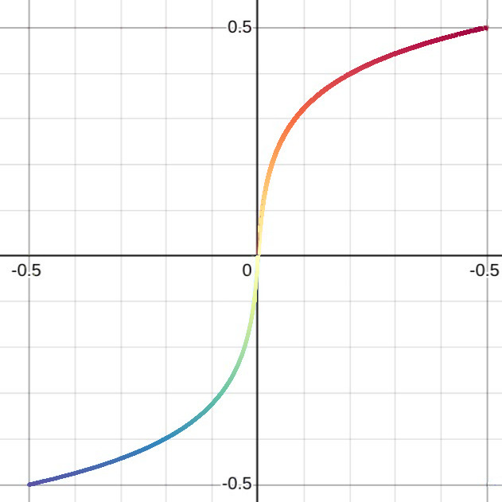

# Dopings: Automação de dopagem, adsorção, otimização e análise de estruturas

Esse conjunto de programas foi idealizado e escrito por mim, em Python, como parte do projeto de pesquisa que participei, no Laboratório de Simulação Computacional do Departamento de Física da UFJF como bolsista da CNPq, com objetivo de pesquisar novos possíveis materiais e suas propriedades teóricas ao simular computacionalmente flocos de grafeno e grafino com impurezas diversas, em variadas posições. As simulações foram feitas utilizando o pacote de simulação quântica DFTB+.

Posteriormente ainda foram desenvolvido outros programas que geram versões de tais estruturas, adsorvidas com moléculas de H2, para estudar a possibilidade de usar tais estruturas em tecnologia de armazenamento de hidrogênio.

| Elementos | Al,  B, Li, Mg,  N,  Na,  O,  P, Si,  Ti,  Zn |
|-|-|
| Bases grafino | grafino 1, 2, 3, 4, 5 |
|Bases grafeno  | armchair edges, zizag edges |

Foram geradas, otimizadas e processadas, um total de 1.540 estruturas. Além de mais de 3.500 versões de estruturas adsorvidas com H2.

## Índice

1. [Funcionalidades](#funcionalidades)
2. [Dopagens](#dopagens)
3. [Adsorção com H2](#adsorcao)
4. [Relatório de otimização](#relatorio)
5. [Visualizações](#viz)
6. [Frames finais de geometria](#frametree)
7. [Documentação](#docs)

## Funcionalidades <a name="funcionalidades"></a>

* Criar versões em lote, de várias estruturas base, dopadas por vários elementos químicos, em diversas posições;
* Criar um diretório de otimização para cada estrutura, com os arquivos e informações necessárias;
* Criar filas de otimizações do DFTB+, com um leve nível de auto gerência;
* Gerar relatório do estado e progresso das otimizações;git push --set-upstream origin cached
* Extrair os dados necessário dos arquivos e criar objetos que representando as estruturas;
* Escrever tais objetos como arquivos para acelerar a leitura nos diversos processos;
* Gerar árvores de diretórios organizadas com o arquivo de geometria final da otimização;
* Gerar visualizações e processamentos dos dados para viabilizar a análise da grande quantidade de resultados;
* Gerar novas estruturas adsorvidas com H2, para diversos tamanhos e formas de estruturas, tanto para floco, quanto para periódica.

## Dopagens <a name="dopagens"></a>

Exemplos de estruturas onde houve substituição de átomos de carbono por de outros elementos:

|  |  | 
| - | - |
|  |  |

## Adsorção com H2 <a name="adsorcao"></a>

Estruturas que receberam camadas de H2 para estudo de adsorção. Fiz um ajuste de uma curva às coordenadas de cada estrutura, para poder fazer a sobreposição das moléculas sobre as mesmas. Além disso utilizei uma grade retangular para distribuir uniformemente os H2 sobre a estrutura periódica, enquanto usei uma distribuição derivada para espalhar essas moléculas nas estruturas hexagonais.

|  |  | 
| - | - |
|  |  |

## Relatório de otimização <a name="relatorio"></a>

Modelo de relatório do estado das otimizações:

```
graphene-B-ac-B-B6 - Converged      | Last step: 34
graphene-B-ac-B-B7 - Converged      | Last step: 36
graphene-B-ac-B-B8 - Converged      | Last step: 36

        Not converged SCC's: [0] => 2.8% of total

graphene-B-ac-B9 - Converged      | Last step: 39
graphene-B-ac-B10 - Converged      | Last step: 39
graphene-B-ac-B11 - Converged      | Last step: 40
graphene-B-ac-B12 - Converged      | Last step: 41

        Not converged SCC's: [1, 2] => 4.9% of total

graphene-B-ac-B13 - Converged      | Last step: 36

        Not converged SCC's: [0] => 2.8% of total

graphene-B-ac-B14 - Converged      | Last step: 45
graphene-B-ac-B15 - Converged      | Last step: 43
graphene-B-ac-B16 - Converged      | Last step: 59
```

## Resultados <a name="resultados"></a>


### Visualizações <a name="viz"></a>

#### Mapa de distribuição de elétrons pela estrutura

Plot de pontos que através da cor e tamanho dos pontos ilustram como os elétrons estão distribuídos pela estrutura.

Usa uma escala logarítimica de cores que permite destacar pequenas diferenças de cargas entre pontos, com uma grande amplitude dos dados.

|  |  |
| - | - |


#### Histograma dos comprimentos de ligação

Vizualização da distribuição dos comprimentos de ligação presentes na estrutura. É padronizado com limites de eixos que comportem qualquer estrutura, para fácil comparação visual.

Leva em conta critérios de comprimentos máximos de ligação para cada par de elementos químicos.

|  |
|-|


#### Gráficos de descrição de geometria do grafino

Plot composto que resume a geometria de diversas estruturas otimizadas, para fácil análise dos resultados.

|  | 
| - | 

#### Gráfico de gap eletrônico, para as dopagens de diversos elementos na mesma posição da estrutura

Gráfico que relaciona a energia do HOMO e do LUMO em um mesmo sítio de dopagem, para diferentes elementos químicos.

|  | 
|-|

## Frames finais de geometria <a name="frametree"></a>

Árvore de diretórios com a geometria do último passo de otimização da estrutura, para fácil acesso à geometria e fácil vizualização e comparação de diversos resultados:

|  |
|-| 

## Estrutura do programa

### Classes principais:

* Atom - Descreve um átomo.
* Structure - Descreve uma estrutura, tendo uma lista de átomos, além de outros dados.
* DopingSet - Descreve um conjunto de dopagens.

### Classes de métodos estáticos:

* StructRead - Métodos para extrair dados dos arquivos de saída do DFTB+.
* StructViz - Métodos que geram vizualizações da estrutura.
* SetViz - Métodos que geram vizualizações de um conjunto de estruturas.
* GraphineCalcs - Métodos que provêm cálculos extras focados nas particulariedades do grafino.
* H2Gen - Métodos que geram versões de estruturas adsorvidas com H2.

### Arquivos de configurações e dados para os processos:

* Configurações das vizualizações.
* Dados de diretórios,
* Dados do conjunto de dopagens,
* Dados dos átomos de cada elemento,
* Dados da geração de H2,
* Dados extras dos grafinos,

## Uso

Uso no próprio diretório, sem necessidade de instalação através da execução direta dos scripts no diretório "scripts".

## Documentação <a name="docs"></a>

A documentação está hospedada no Read the Docs e pode ser acessada pelo link abaixo:

https://dopagens.readthedocs.io/